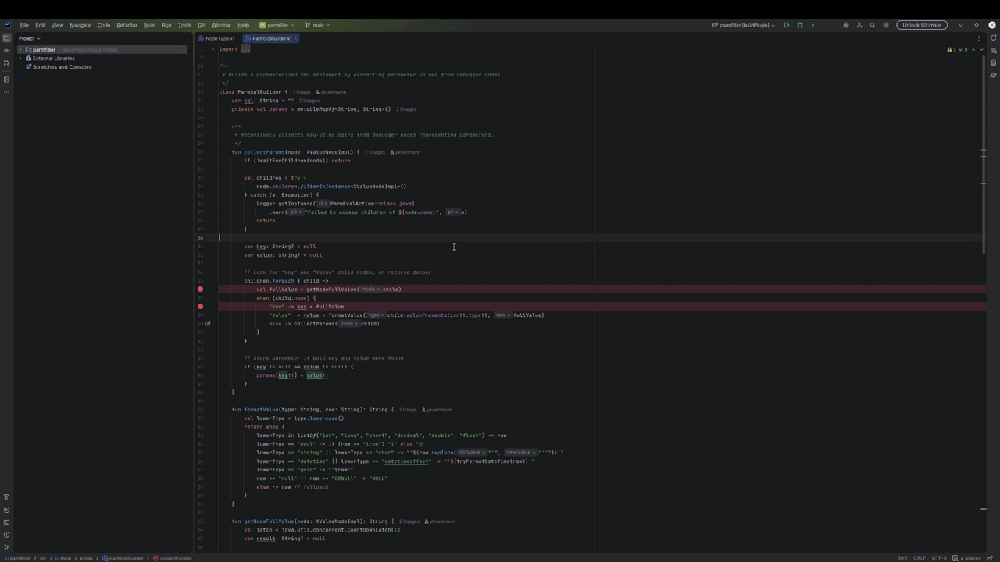
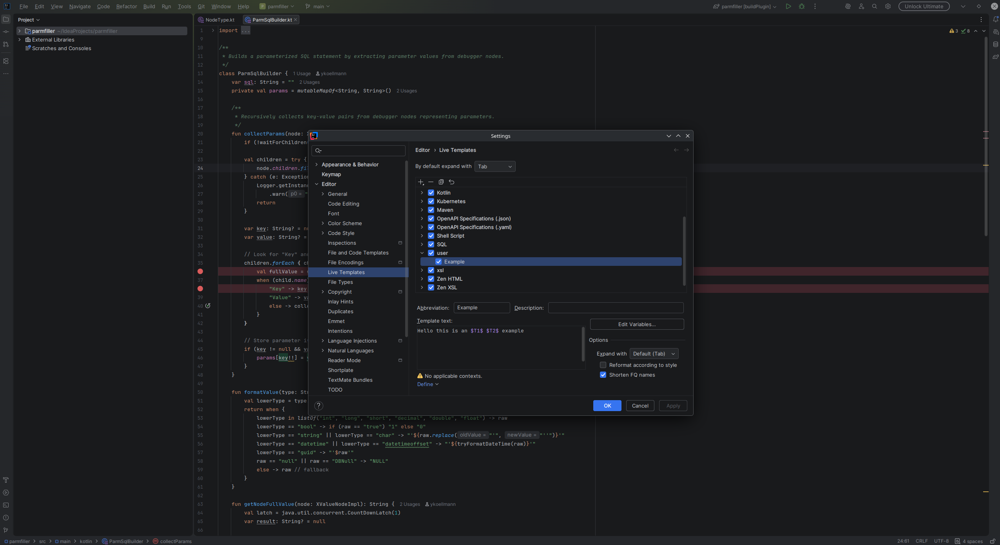
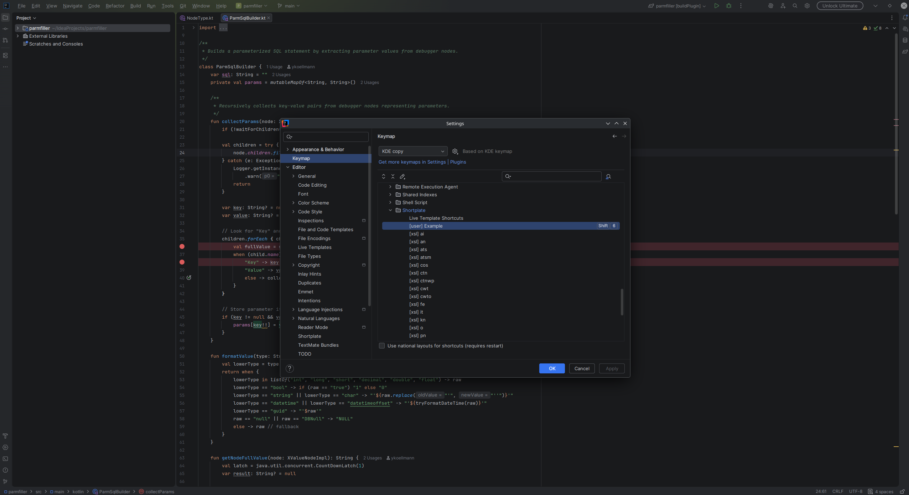
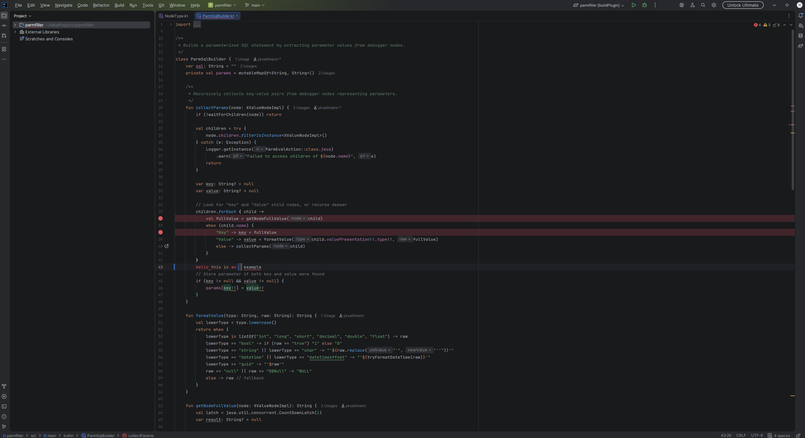
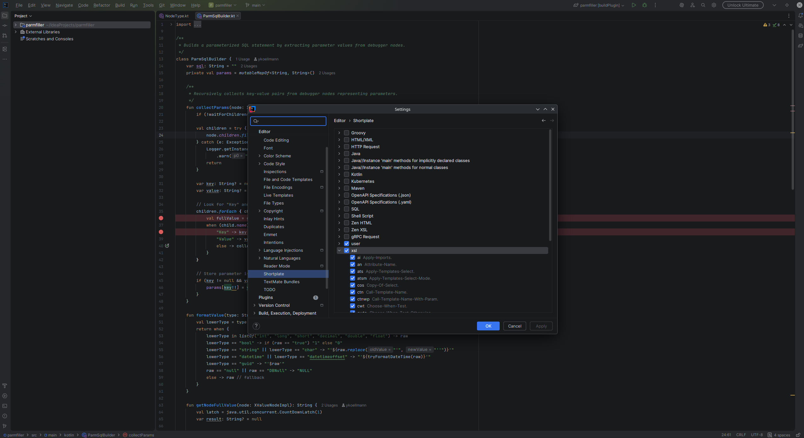

# Shortplate

Assign keyboard shortcuts to any Live Template — directly via the standard JetBrains Keymap dialog.

---

## The problem

JetBrains IDEs have no built-in way to assign keyboard shortcuts to individual Live Templates.
This has been a long-standing community request: [IJPL-337](https://youtrack.jetbrains.com/issue/IJPL-337)

Shortplate solves this by registering each Live Template as a proper IDE action, making them
first-class citizens in the Keymap dialog.

---

## Features

- **All Live Templates become actions** — every template from every group appears in Settings → Keymap under *Live Template Shortcuts*
- **Standard Keymap integration** — assign shortcuts exactly like any other IDE action, with full conflict detection
- **Dynamic registration** — templates added during a session appear in Keymap immediately, no restart required
- **Filter per group** — hide entire template groups from the Keymap list via Settings → Editor → Shortplate
- **Non-destructive** — previously assigned shortcuts remain active even if a template is later hidden in the filter

---

## Usage

1. Create a Live Template in **Settings → Editor → Live Templates**

   

2. Open **Settings → Keymap**, expand **Plugins → Shortplate and assign a shortcut

   

3. Use the shortcut anywhere in the editor — the template expands as usual

   

To control which templates appear in the Keymap list, go to **Settings → Editor → Shortplate**.

---

## Installation

1. Open IntelliJ IDEA / any JetBrains IDE
2. Go to **Settings → Plugins → Marketplace**
3. Search for **"Shortplate"**
4. Click **Install** and restart

---

## Contributing

Found a bug or have a feature idea? Open an issue on GitHub.
